# HCDConnect

[](https://github.com/JhunDevRey/HCDConnect/actions/workflows/ci.yml) [](https://github.com/JhunDevRey/HCDConnect/releases/latest) [](LICENSE)

HCDConnect is an Android app for campus events at Holy Cross of Davao College (HCDC). Students can browse and RSVP to events. Club organizers post and manage events for their club, and admins manage clubs and users.

## Screenshots

### Student view

Students can browse events and RSVP. They don't see the **New event** button, the **Manage users & clubs** menu item, or the edit and delete options on events.

| Events dashboard | Menu | Event details |
|:---:|:---:|:---:|
| 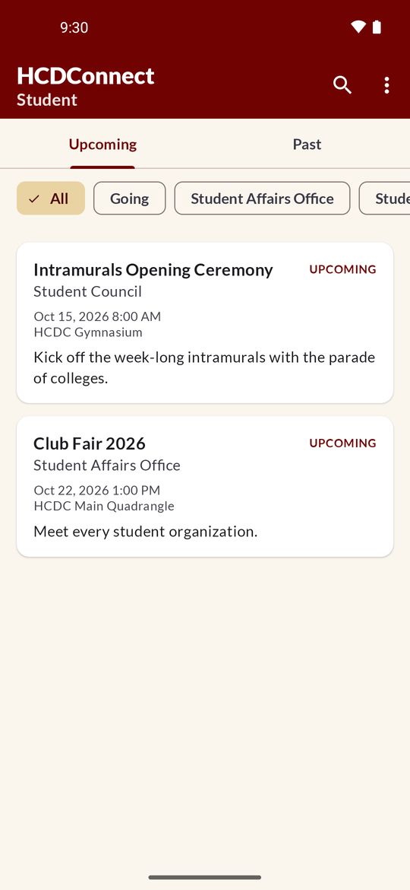 | 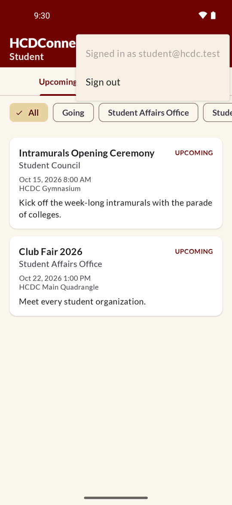 | 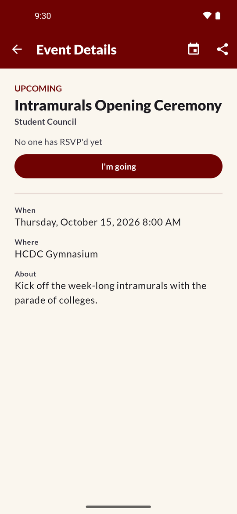 |

### Organizer view

Organizers get the **New event** button and can post only for their own club. The club is filled in on the form. They can edit and delete the events they created. They don't see **Manage users & clubs**.

| Events dashboard | Menu | New event (own club only) |
|:---:|:---:|:---:|
| 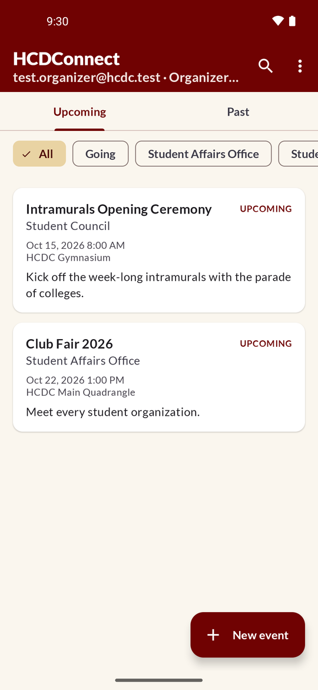 | 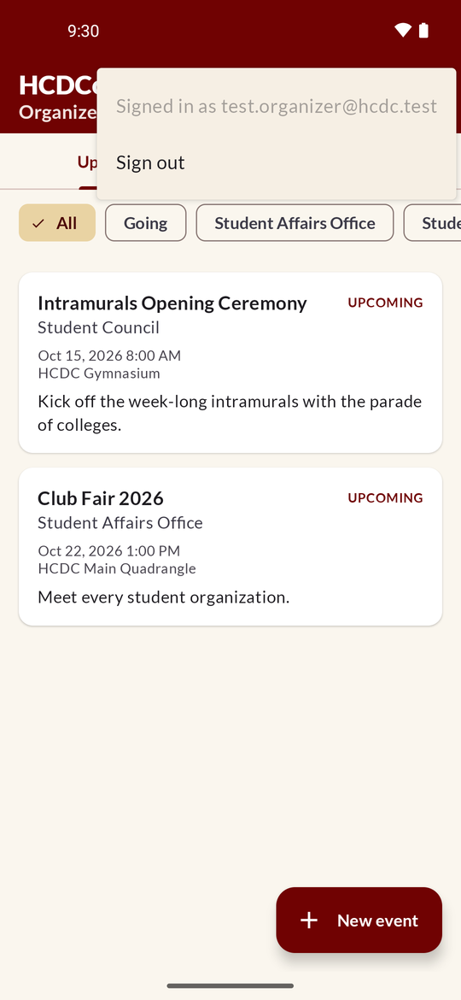 | 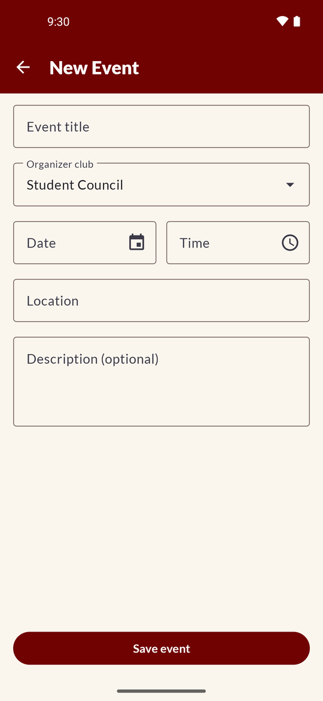 |

### Admin view

| Sign in | Events dashboard | Event details |
|:---:|:---:|:---:|
| 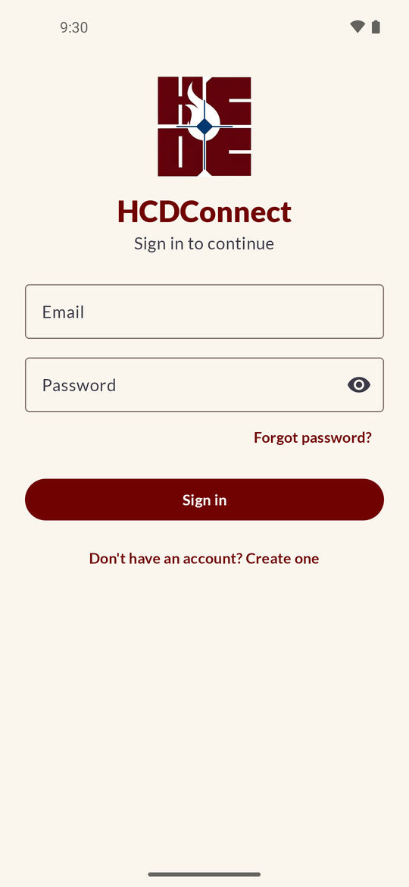 | 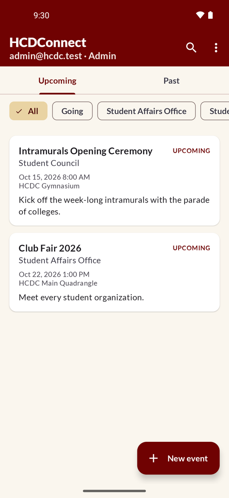 | 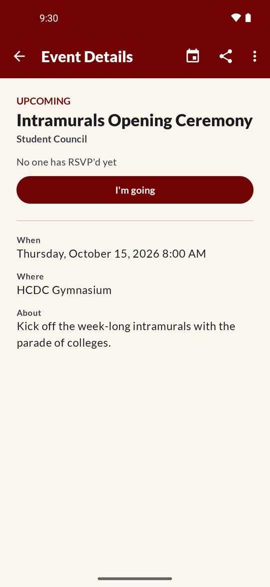 |
| **New event** | **Manage users & clubs** | **Dark mode** |
|  | 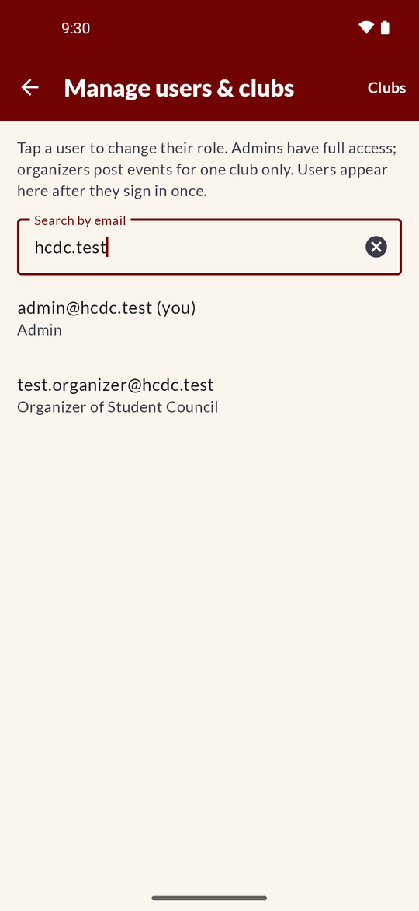 | 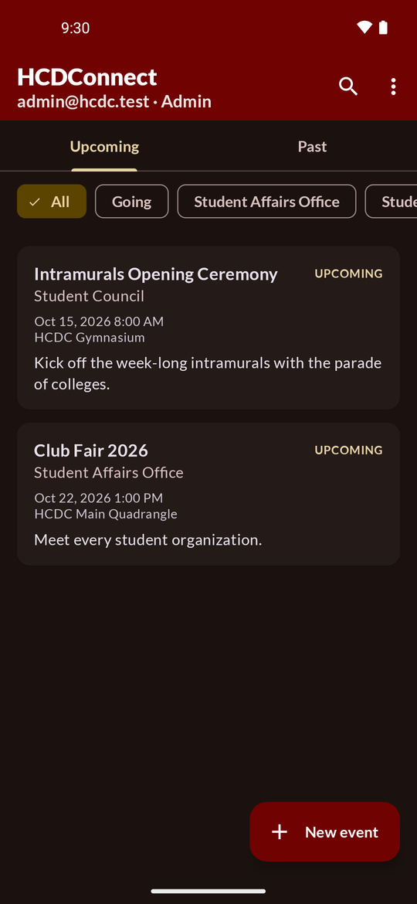 |

## Features

- **Event dashboard:** a live list of campus events with search, club filter chips, and tabs. Pull down to refresh.
- **Event details and RSVP:** open an event to see when and where it is and what it's about, mark yourself as going, or share it.
- **Event reminders:** a notification before events you've RSVP'd to.
- **Event status:** Upcoming, Ongoing, Completed or Cancelled. Events that have already started show as Completed automatically.
- **Campus time:** event times are always shown and entered in Asia/Manila time, whatever time zone the device is set to.
- **Roles:**
  - **Student:** any signed-in user without another role. Can view events and RSVP. The **New event** button and **Manage users & clubs** menu item are hidden.
  - **Organizer:** belongs to one club. Can create, edit and cancel that club's events.
  - **Admin:** can manage every event, club and organizer, and other admins. Admins can also delete any user except themselves: tap the user in **Manage users & clubs**, then **Delete this user**.
- **HCDC branding:** maroon and gold theme and the Lato font, with light and dark mode.

## Tech stack

- Kotlin and Android Views with ViewBinding and Material Components
- MVVM with ViewModel, coroutines and `StateFlow`
- Firebase Authentication (email and password) and Cloud Firestore
- WorkManager for event reminders
- Min SDK 26, target SDK 36

## Project structure

```
app/src/main/java/com/hcdc/hcdconnect/
├── data/
│   ├── model/          # CampusEvent, EventStatus
│   └── repository/     # Auth, events, clubs, organizers, roles, users (Firestore)
├── reminders/          # Scheduling and posting event reminder notifications
├── ui/
│   ├── auth/           # Login
│   ├── dashboard/      # Event list, filters and adapter
│   ├── eventdetail/    # Event details and RSVP
│   ├── createevent/    # Create and edit events
│   ├── admin/          # Manage users, organizers and clubs
│   └── common/         # Campus time zone and system bar helpers
└── MainActivity.kt     # Dashboard (launcher screen)
firestore.rules         # Firestore security rules (mirrors the published rules)
```

## Getting started

1. Clone the repo:
   ```
   git clone https://github.com/JhunDevRey/HCDConnect.git
   ```
2. Open the project in Android Studio.
3. To use your own Firebase project:
   - Create a Firebase project and add an Android app with the package name `com.hcdc.hcdconnect`.
   - Download `google-services.json` and replace `app/google-services.json` with it.
   - Turn on **Email/Password** sign-in in Firebase Authentication.
   - Create a Cloud Firestore database and publish the rules in `firestore.rules`.
4. Build and run on an emulator or device (Android 8.0 or later).

## Resetting a forgotten password

Password resets use Firebase Authentication's reset email, so the app doesn't need a screen for choosing a new password.

1. On the sign-in screen, enter your email address. You don't need to enter a password.
2. Tap **Forgot password?**.
3. The app shows "Password reset email sent. Check your inbox."
4. Open the email from Firebase and follow the link to set a new password. If it isn't in your inbox, check spam.
5. Go back to the app and sign in with your new password.

If the email is blank or badly formatted, the email field shows an error and nothing is sent. If the request fails, the app shows a message, for example when there's no internet connection or after too many attempts.

Notes:

- Firebase doesn't say whether an account exists for the email, so people can't use this to find out who has an account. If no account uses that email, no email arrives.
- The `@hcdc.test` test accounts don't have real inboxes, so they never get reset emails. Use an account with a real email address to test this.
- To change the email's wording, sender name or reset page, go to **Authentication → Templates → Password reset** in the Firebase console.

The code is in `LoginActivity` (button), `LoginViewModel.sendPasswordReset()` (email checks and messages) and `AuthRepository.sendPasswordReset()` (calls `FirebaseAuth.sendPasswordResetEmail`).

## Firestore data model

| Collection | Document ID | Contents |
|---|---|---|
| `events` | auto | `title`, `organizerClub`, `date`, `location`, `description`, `status`, `createdBy`, `attendees` |
| `clubs` | club name | One document per club |
| `organizers` | user UID | `email`, `clubs` (at most one club) |
| `admins` | user UID | Marks the user as an admin |
| `users` | user UID | `email`, `lastSignIn` |
| `removedUsers` | user UID | `email`, `removedBy`, `removedAt`. Users deleted by an admin; the rules block them from everything |

To make the first admin, create a document in `admins` with that user's UID as the document ID. After that, admins can manage roles in the app's **Manage users & clubs** screen.

Deleting a user adds them to `removedUsers` and deletes their profile, roles and RSVPs in one step. Events they posted stay. The free Firebase plan can't delete sign-in accounts from the app, so their account still exists but can't use the app; if they sign in, they're told the account was removed. To restore someone, delete their document in `removedUsers` in the Firebase console. They'll come back as a student.

## Getting help

Having trouble? See [SUPPORT.md](SUPPORT.md) for common problems and where to ask for help.

## Contributing

Contributions are welcome. See [CONTRIBUTING.md](CONTRIBUTING.md) for setup, conventions and how to send a pull request. Everyone taking part is expected to follow the [Code of Conduct](CODE_OF_CONDUCT.md). To report a security problem, see [SECURITY.md](SECURITY.md).

## License

HCDConnect is released under the [MIT License](LICENSE).
